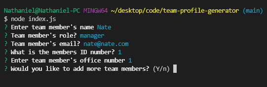
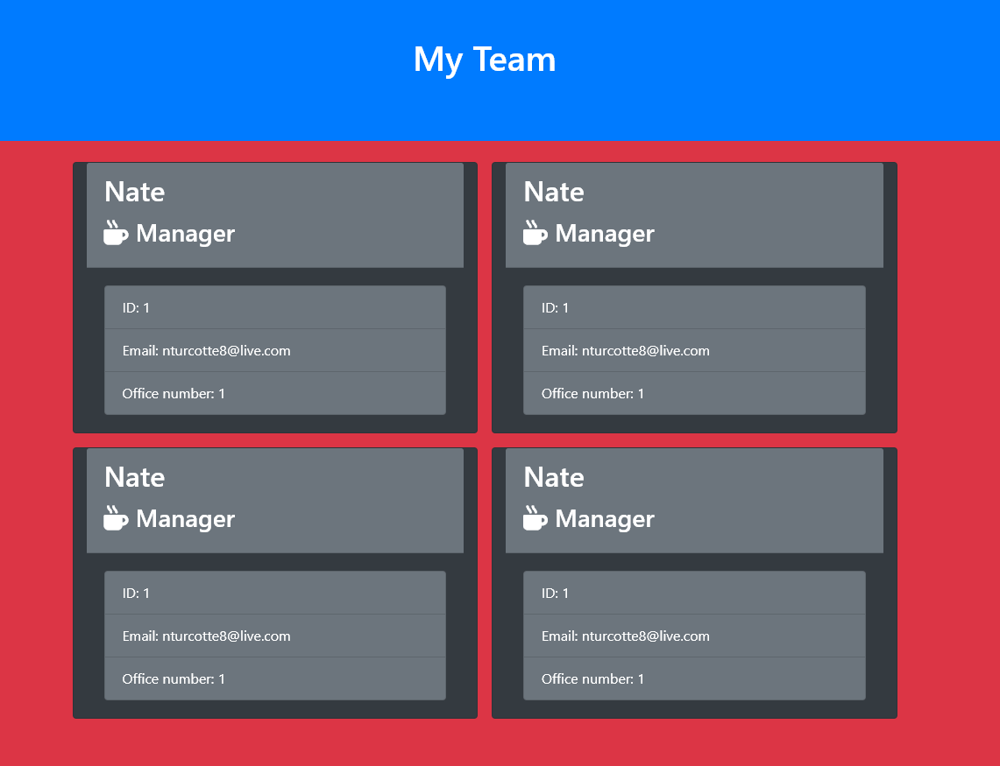
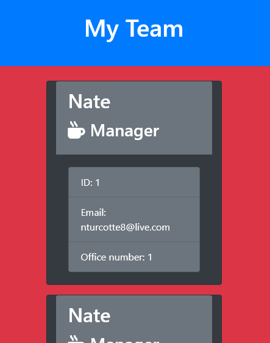

# Team Profile Generator

[](https://opensource.org/licenses/MIT)
 ## Table of Contents
* [Installation](#installation)
* [Instructions](#instructions)

* [Questions](#questions)
* [License](#license)

## Description:
The purpose of this application is to generate a team profile webpage. The webpage is generated using user inputs from multiple inquirer questions. The user story is as follows,
```md
AS A manager
I WANT to generate a webpage that displays my team's basic info
SO THAT I have quick access to their emails and GitHub profiles
```
and has the following acceptance criteria.
```md
GIVEN a command-line application that accepts user input
WHEN I am prompted for my team members and their information
THEN an HTML file is generated that displays a nicely formatted team roster based on user input
WHEN I click on an email address in the HTML
THEN my default email program opens and populates the TO field of the email with the address
WHEN I click on the GitHub username
THEN that GitHub profile opens in a new tab
WHEN I start the application
THEN I am prompted to enter the team manager’s name, employee ID, email address, and office number
WHEN I enter the team manager’s name, employee ID, email address, and office number
THEN I am presented with a menu with the option to add an engineer or an intern or to finish building my team
WHEN I select the engineer option
THEN I am prompted to enter the engineer’s name, ID, email, and GitHub username, and I am taken back to the menu
WHEN I select the intern option
THEN I am prompted to enter the intern’s name, ID, email, and school, and I am taken back to the menu
WHEN I decide to finish building my team
THEN I exit the application, and the HTML is generated
```

## Installation
open `index.js` and run the following command
```
npm i
```

## Instructions
Demonstration of application can be found <a href="https://youtu.be/qh_pXoOuc3o">here</a>.

After running `npm i` in your terminal run the following command
```
node index.js
```



This will initialize the application and you will see an inquirer prompt. From here you can start adding members to your team. The application will ask you for the folowwing information.
* Name
* Role
    * Manager
        * Email
        * ID number
        * Office Number
    * Engineer
        * Email
        * ID Number
        * GitHub Username
    * Intern
        * Email
        * ID Number
        * School Name

After you finish answering the questions for a team member the application will ask if you want to add another team member. Entering `y` will start the prompts over again for a new team member, entering `n` will generate a webpage with the inputs to the prompts and stop the application. The generated webpage will be located in the output folder.





## Quesions
If you have any questions, contact me <a href="https://github.com/TheHebi" target="_blank">here</a>, or send me an email at nturcotte8@live.com.

## License 
 This project uses the MIT License
